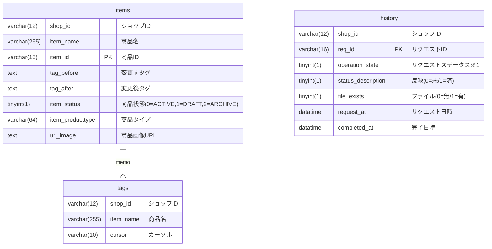

```mermaid
erDiagram

items ||--|{ tags : "memo"

history {
  varchar(12) shop_id "ショップID"
  varchar(16) req_id PK "リクエストID"
  tinyint(1) operation_state "リクエストステータス※1"
  tinyint(1) status_description "反映(0=未/1=済)"
  tinyint(1) file_exists "ファイル(0=無/1=有)"
  datatime request_at "リクエスト日時"
  datatime completed_at "完了日時"
}

items {
  varchar(12) shop_id "ショップID"
  varchar(255) item_name "商品名"
  varchar(15) item_id PK "商品ID"
  text tag_before "変更前タグ"
  text tag_after "変更後タグ"
  tinyint(1) item_status "商品状態(0=ACTIVE,1=DRAFT,2=ARCHIVE)"
  varchar(64) item_producttype "商品タイプ"
  text url_image "商品画像URL"
}

tags {
  varchar(12) shop_id "ショップID"
  varchar(255) item_name "商品名"
  varchar(10) cursor "カーソル"
}

```
Database:itemsBulkApp 
※1 
1: CANCELED 
2: CANCELING 
3: COMPLETED 
4: CREATED 
5: EXPIRED 
6: FAILED 
7: RUNNING

